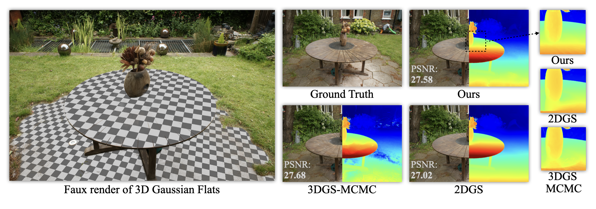

# 3D Gaussian Flats: Hybrid 2D/3D Photometric Scene Reconstruction

[](https://theialab.github.io/3dgs-flats/)
[](assets/3dgs-flats.pdf)

<span class="author-block">
  <a href="https://mtaktash.github.io/">Maria Taktasheva</a>,
</span>
<span class="author-block">
  <a href="https://lilygoli.github.io/">Lily Goli</a>,
</span>
<span class="author-block">
  <a href="https://github.com/FloweroCoder/">Alessandro Fiorini</a>,
</span>
<span class="author-block">
  <a href="https://colinzhenli.github.io/">Zhen (Colin) Li</a>,
</span>
<span class="author-block">
  <a href="http://drebain.com/"> Daniel Rebain</a>,
</span>
<span class="author-block">
  <a href="https://taiya.github.io/">Andrea Tagliasacchi</a>
</span>




<section class="section" id="BibTeX">
  <div class="container is-max-desktop content">
    <h2 class="title">BibTeX</h2>
    <pre><code> to-do
   </code></pre>
  </div>
</section>


## Updates
### 26/08/2025

Code released!

## How to Install
This project is built on top of the [Original 3DGS code base](https://github.com/graphdeco-inria/gaussian-splatting), [3DGS-MCMC code base](https://github.com/ubc-vision/3dgs-mcmc) and [2DGS code base](https://github.com/hbb1/2d-gaussian-splatting) and has been tested only on Ubuntu 22.04. If you encounter any issues, please refer to the sources for installation instructions.


### Installation Steps

1. **Clone the Repository:**
   ```sh
   git clone --recursive https://github.com/theialab/3dgs-flats.git
   cd 3dgs-flats
   ```
2. **Set Up the Conda Environment:**
    ```sh
    conda env create --file environment.yml
    conda activate 3dgs-flats
    ```

## How to run
Running code is similar to the [3DGS-MCMC code base](https://github.com/ubc-vision/3dgs-mcmc) with the following differences:

- You need to provide `--mask_root` argument containing mask per planes, you can obtain the masks following the instructions in `data_preparation/README.md`
- `--debug_render` option provides a debug information for planar Gaussians visualization during training to monitor planar dynamics. It visualizes Gaussian means belonging to different planes using different colors and provides projections of planar Gaussian means to xy, yz and xz axes


## Example on ScanNet++

1. Download a ScanNet++ scene from the [Official webpage](https://kaldir.vc.in.tum.de/scannetpp/), e.g. `7079b59642` from the paper
2. Obtain the masks for undistorted images following the instructions in `data_preparation/README.md`
3. Run a trainer

```
python train_planar.py  \
  -s scannetpp/data/7079b59642/iphone \
  -m output/7079b59642  \
  --init_type sfm  \
  --config configs/iphone/7079b59642.json  \
  --mask_root data_preparation/sam2/output/7079b59642 \
  --eval
```
Tips:
- Make sure to undistort iPhone datasets before using them
- Render depth from a GT mesh to compute the metrics
- Automatic masks extraction on DSLR datasets might be not as reliable as the input images are not a video, so it usually works better on iPhone video datasets 
- Restarting a training from `.ply` point cloud files is not supported, one needs to use a checkpoint if necessary to restart the planar training

4. Run a renderer for novel view synthesis

```
python render.py \
  -m output/7079b59642 \
  --skip_video \
  --skip_mesh
```
- `--skip_video` argument is used to skip rendering of video (see script for optional paths)
- `--skip_mesh` argument is used to skip TSDF mesh extraction (similar to 2DGS)

5. Run a renderer for faux plane renders and planar mesh extraction

```
python render.py \
  -m output/7079b59642 \
  --skip_video
```

6. Metrics (NVS and depth):
- Run `python metrics.py --model_paths output/7079b59642`
- Make sure your `output/7079b59642` folder contains Ground Truth depth renders in `train/depth_gt` and `test/depth_gt` subfolders

7. Metrics (planar mesh)
- We used the scripts from [AirPlanes](https://github.com/nianticlabs/airplanes) to compute the planar mesh metrics
- To obtain a planar mesh for ScanNet++, we used the script in `data_preparation/planar_mesh`

```
python generate_ground_truth_scannetpp.py \
  --scannetpp %scannetpp/root% \
  --output %output/path% \
  --scene-ids 7079b59642
```

8. Metrics (full mesh)
- We used the scripts from [DN-Splatter](https://github.com/maturk/dn-splatter) to compute the full mesh metrics on ScanNet++
- Note that the ScanNet++ mesh in our code is already aligned with Ground Truth mesh, so one does not need to use the transform in DN-Splatter code